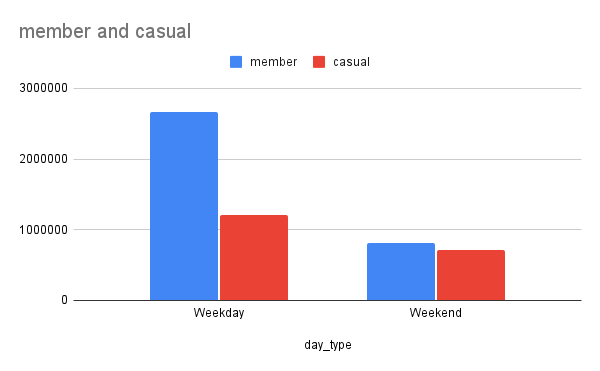
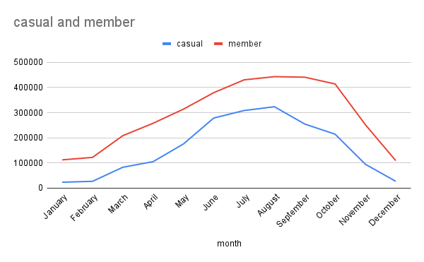
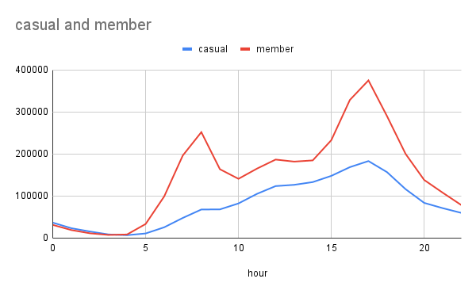

# Cyclistic Bike-Share Case Study (Google Data Analytics Capstone)

## Business Task
Cyclistic wants to increase annual memberships.  
This case study analyses how **casual riders** and **annual members** use bikes differently, then recommends actions to convert casual riders into members.

## Data
- Source: Divvy (Chicago) bike-share trip data (12 months)
- Tooling: BigQuery (SQL) for cleaning + analysis, Google Sheets for charts
- Total rides analysed: **5,400,008**

> Note: This analysis focuses on trip behaviour. Personally identifiable information is not used.

---

## Key Findings

### 1) Members ride like commuters, casual riders ride like leisure users
Members show clear peaks during commuting hours (around **08:00–09:00** and **17:00–18:00**).  
Casual rides increase through late morning and peak in the afternoon.

**Interpretation**
- **Members** = routine transportation
- **Casual** = flexible / leisure trips

---

### 2) Casual ridership is strongly seasonal
Casual rides rise heavily in warm months and peak in summer.  
Member ridership stays relatively stable across the year.

**Interpretation**
- **Casual** = weather-dependent and recreational
- **Members** = consistent year-round usage

---

### 3) Weekdays are member-heavy; weekends become more balanced
Weekday usage is dominated by members, while weekend usage is closer between groups.

---

## Business Insight
Cyclistic has two distinct customer segments:

**Members (transport users)**
- commute-oriented
- predictable daily travel
- consistent behaviour

**Casual riders (leisure users)**
- seasonal behaviour
- weekend activity
- recreational trips

---

## Recommendations

### 1) Convert summer casual riders into members
Target the warm-month peak when casual usage is highest:
- limited-time membership discounts (summer)
- in-app prompts after rides longer than ~15 minutes
- station signage near high-casual areas

### 2) Promote commuting value during peak commute hours
Use the weekday commute pattern to push membership:
- compare “member cost vs pay-per-ride” for frequent users
- messaging timed around morning/evening commuter peaks

### 3) Weekend-to-weekday conversion campaign
Turn weekend riders into weekday riders:
- trial weekday passes
- first-month membership discounts after multiple weekend rides
- “commute challenge” style onboarding

---

## Conclusion
Casual riders are not low-value customers — they are **high-potential future members**.  
By targeting riders during peak engagement periods (especially summer and weekends), Cyclistic can increase membership adoption and improve revenue stability.

---

## Files in this repo
- `README.md` → case study write-up (this page)
- `images/` → charts used in the analysis
